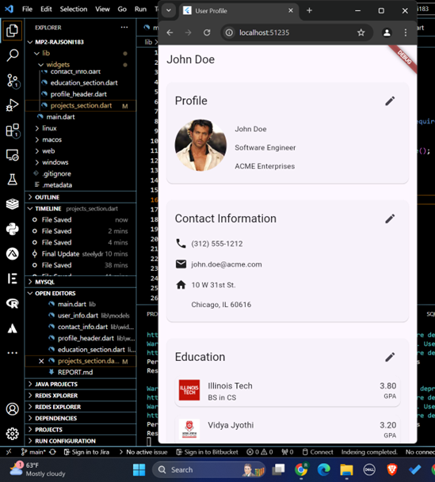
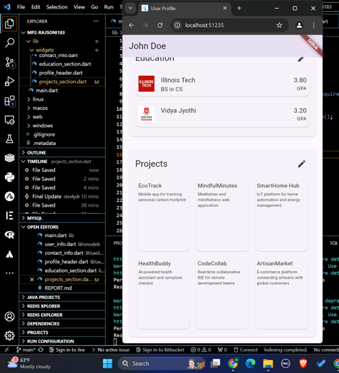

The code uses StatefulWidget for components that need to manage their own state, such as ProfileHeader and ContactInfo. This allows for local state management within each component, which is suitable for this scale of application.

The ProfileHeader,ContactInfo,EducationSection and projectSection widgets implement an edit mode toggle, allowing users to switch between viewing and editing their information. This is achieved by conditionally rendering either Text widgets or TextField widgets based on the _isEditing state variable.

The code is well-organized into separate files for different components (e.g., user_info_page.dart, contact_info.dart, profile_header.dart), promoting modularity and easier maintenance.

The UserInfo class includes a createDummy() method, which is useful for testing and development purposes. It provides a quick way to populate the app with sample data.

The current implementation doesn't include form validation for editable fields. Adding validation logic would improve data integrity and user experience.

Enjoyable aspects of this project likely included working with Flutter's widget system to create a responsive and interactive user interface

The challenge of implementing editable fields that seamlessly switch between view and edit modes was probably an interesting problem to solve.

One potential difficulty might have been managing the state across different widgets and ensuring that updates in one part of the UI are reflected correctly in others.